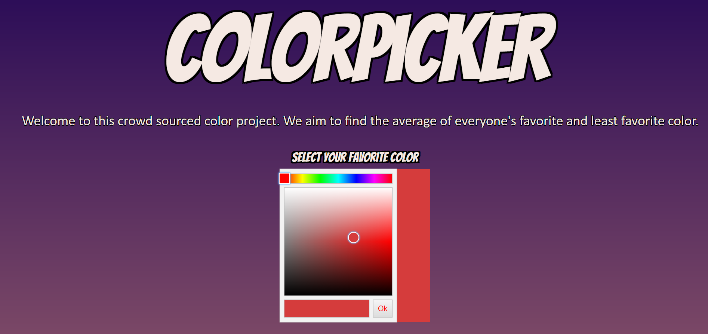
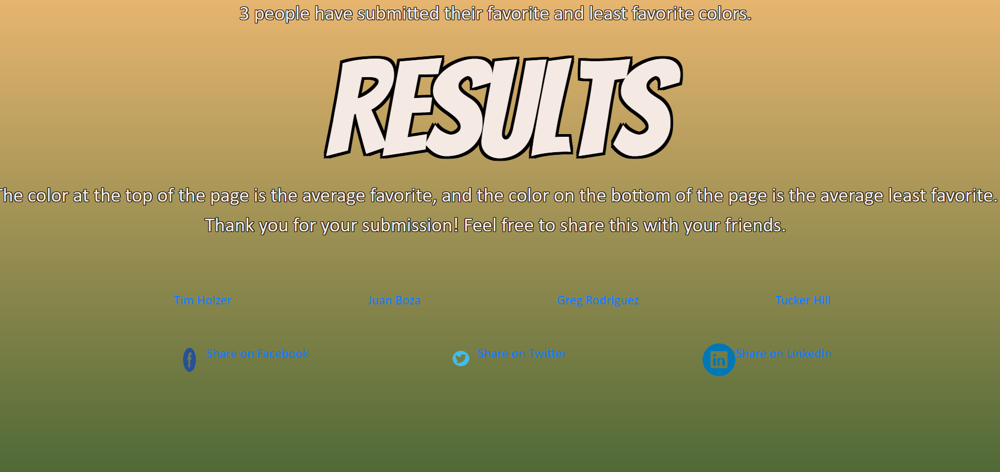

## Color Survey Project
This site is asks the user what their favorite and least favorite colors is in order to find the average for everyone
    
    

* [Installation](#Installation)
    
* [Instructions](#Instructions)

* [Contributors](#Contributors)
    
* [License](#License)
       
    ## Installation
    Pull from the repo, seed the SQL database and then node server.js if you are running on localhost:3001
    
    ## Instructions
    A live link to this project can be found at: https://colorproject.herokuapp.com/ If the user hasn't submitted before then they will be prompted to pick their favorite color and then their least favorite color form a color picker. They will then be redirected to a results page where they are told how many people have submitted. The page will ahve a color gradient wher ethe top of the page is the average favorite color of everyone and the bottom of the page will be the average least favorite color of eveyone who has submitted. They will then only be able to see the results page, even if they come back later. If they come back later the page will update if anyone else submitted.    

    ## Technology used 

    * HTML 
    * CSS 
    * MySQL 
    * JavaScript 
    * Heroku 
    * Vanilla Color Picker by Andreas Borgen
    
    ## Contributors 

    *  Tim Holzer Github: https://github.com/timholzer
    *  Juan Boza Github: https://github.com/JuanBoza
    *  Greg Rodriguez Github: https://github.com/Greg15323
    *  Tucker Hill Github: https://github.com/hill1635

    ## License 
    
    * This project is licensed under the MIT license
    * Heroku Live Link: https://colorproject.herokuapp.com/ GitHub Repo: https://github.com/Greg15323/Color_project/
        